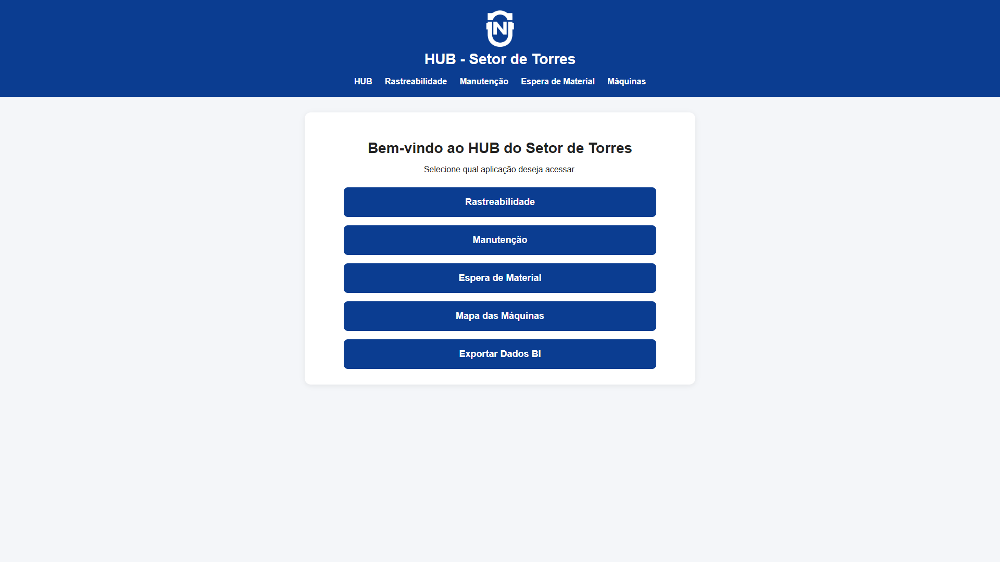
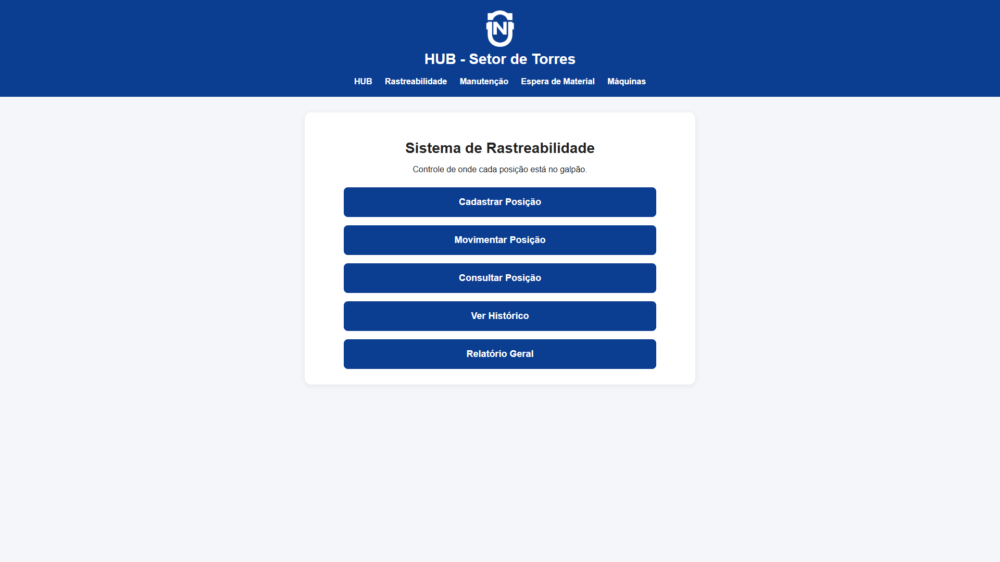
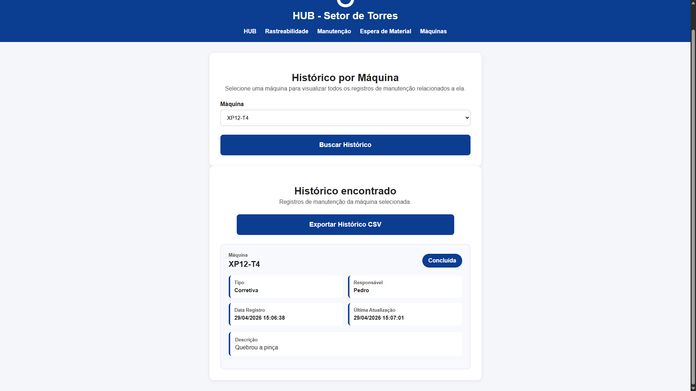
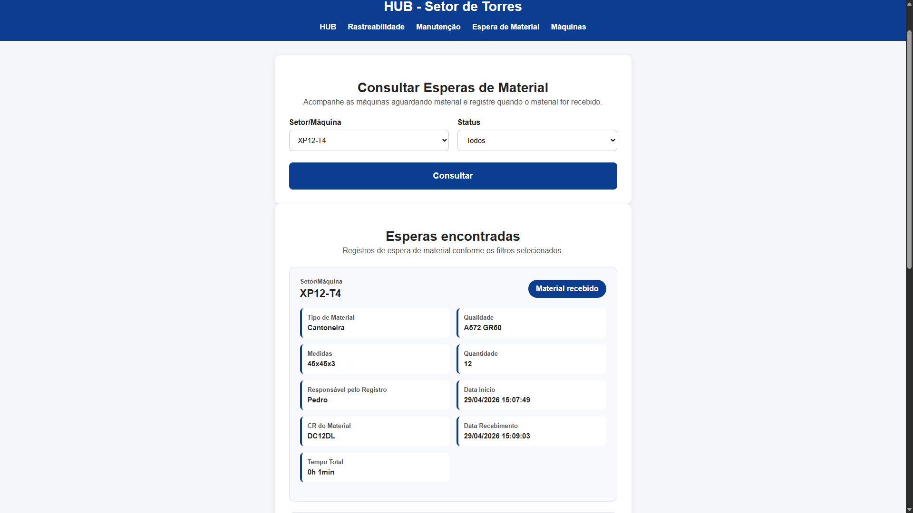
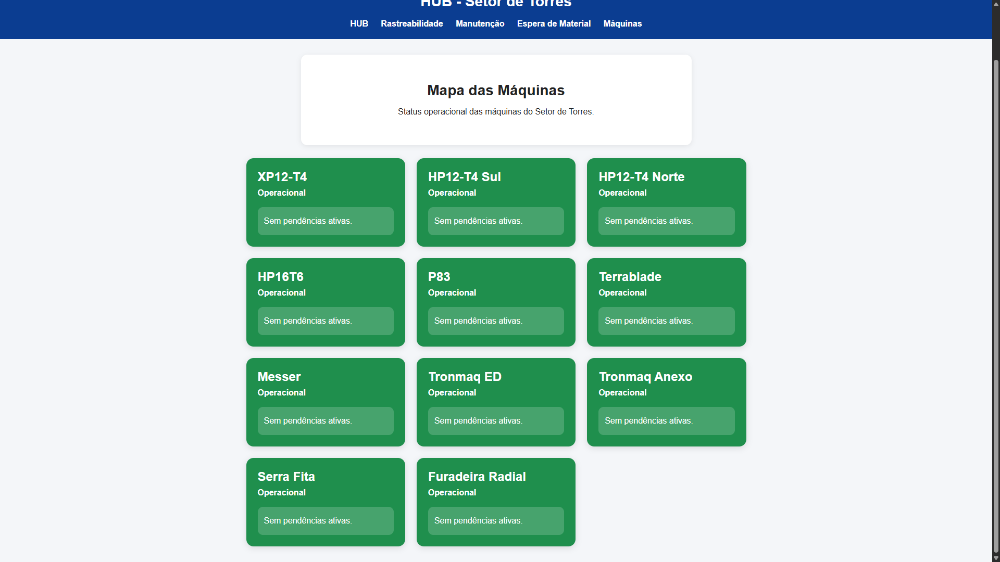
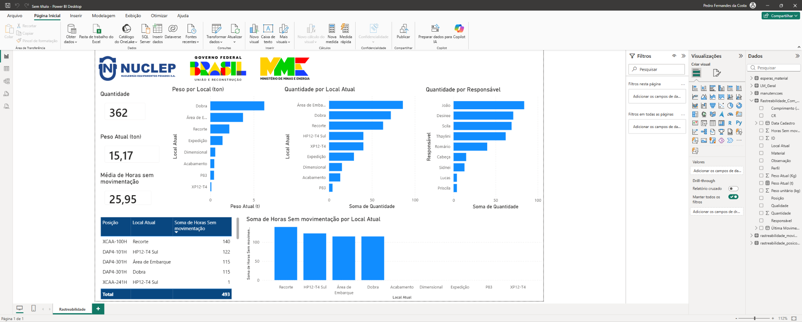
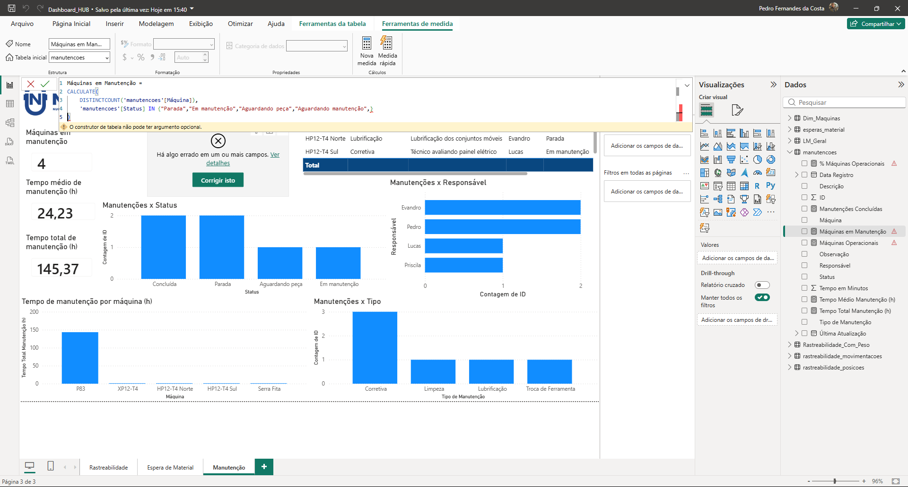
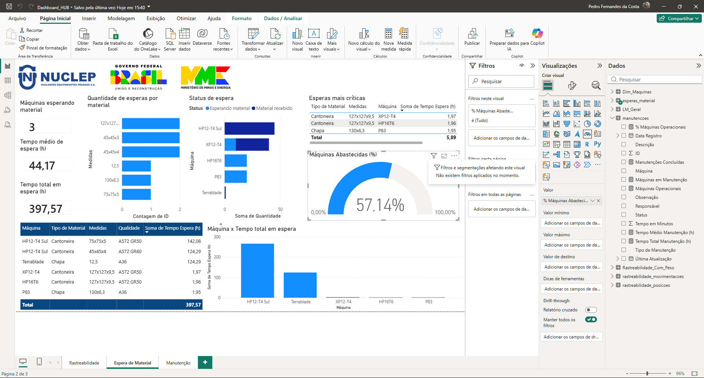

# Industrial Operations Hub

Sistema web desenvolvido em **Python e Flask** para apoio ao controle operacional em ambientes industriais, com foco em rastreabilidade, organização de processos, acompanhamento de máquinas e geração de dados para análise.

O projeto simula uma aplicação real de fábrica, utilizando dados fictícios, e foi criado com o objetivo de demonstrar a aplicação de tecnologia na melhoria da gestão operacional, digitalização de processos e apoio à tomada de decisão.

---

## Visão Geral

O **Industrial Operations Hub** centraliza informações importantes do chão de fábrica em uma aplicação web simples, visual e funcional.

A plataforma reúne módulos voltados para:

- Rastreabilidade de peças e posições;
- Controle de movimentações;
- Registro de manutenção de máquinas;
- Controle de espera de material;
- Mapa visual de status das máquinas;
- Exportação de dados para análise em BI.

O sistema foi pensado para substituir controles manuais e planilhas dispersas por uma solução mais organizada, acessível e integrada.


## Demonstração Visual

### Tela Inicial




### Módulo de Rastreabilidade




### Módulo de Manutenção




### Módulo de Espera de Material




### Mapa Visual de Máquinas




### Exportação e Análise de Dados

### Traceability Dashboard




### Maintenance Dashboard




### Material Waiting Dashboard




## Principais Funcionalidades

### Rastreabilidade de Peças

Permite registrar, consultar e movimentar peças dentro do processo produtivo, mantendo histórico de localização, responsável, observações e última movimentação.

### Controle de Manutenção

Registra máquinas em manutenção, acompanha status e permite organizar o histórico de intervenções realizadas.

### Espera de Material

Permite registrar situações em que uma máquina ou processo está parado aguardando material, facilitando a identificação de gargalos produtivos.

### Mapa de Máquinas

Apresenta uma visão visual do status das máquinas, permitindo rápida identificação de equipamentos disponíveis, em espera ou em situação crítica.

### Exportação de Dados

Gera arquivos para análise externa, possibilitando integração com ferramentas como Excel e Power BI.


## Problema Resolvido

Em muitos ambientes industriais, informações importantes ficam espalhadas em planilhas, anotações manuais ou registros descentralizados.

Isso dificulta:

- acompanhamento da produção;
- identificação de gargalos;
- controle de histórico;
- análise de indicadores;
- tomada de decisão rápida.

O **Industrial Operations Hub** propõe uma solução simples e prática para centralizar esses dados em uma aplicação web.


## Objetivos do Projeto

- Digitalizar controles operacionais industriais;
- Melhorar a rastreabilidade de peças e processos;
- Facilitar a consulta de informações;
- Reduzir dependência de controles manuais;
- Criar base de dados para análise em BI;
- Demonstrar aplicação prática de Python em ambiente industrial.


## Tecnologias Utilizadas

- **Python**
- **Flask**
- **SQLite**
- **HTML**
- **CSS**
- **Pandas**
- **Excel / CSV**
- **Power BI** para análise dos dados exportados

---

## Estrutura do Projeto

```text
industrial-operations-hub/
│
├── app.py
├── README.md
├── requirements.txt
├── .gitignore
│
├── templates/
│   ├── base.html
│   ├── index.html
│   ├── rastreabilidade.html
│   ├── manutencao.html
│   ├── espera_material.html
│   └── mapa_maquinas.html
│
├── static/
│   ├── css/
│   ├── img/
│   └── js/
│
├── instance/
│   └── database.db
│
├── exports/
│   └── arquivos_exportados.csv
│
└── docs/
    └── screenshots/
        ├── tela-inicial.png
        ├── rastreabilidade.png
        ├── manutencao.png
        ├── espera-material.png
        ├── mapa-maquinas.png
        ├── dashboard-traceability.png
        ├── dashboard-maintenance.png
        └── dashboard-material-waiting.png
```

---

## Como Executar o Projeto

### 1. Clone o repositório

```bash
git clone https://github.com/Pedro-fcosta/industrial-operations-hub.git
```

### 2. Acesse a pasta do projeto

```bash
cd industrial-operations-hub
```

### 3. Crie um ambiente virtual

```bash
python -m venv venv
```

### 4. Ative o ambiente virtual

No Windows:

```bash
.\venv\Scripts\activate
```

No Linux/Mac:

```bash
source venv/bin/activate
```

### 5. Instale as dependências

```bash
pip install -r requirements.txt
```

### 6. Execute a aplicação

```bash
python app.py
```

### 7. Acesse no navegador

```text
http://127.0.0.1:5000
```

---

## Possíveis Indicadores Gerados

A partir dos dados registrados no sistema, é possível criar indicadores como:

- quantidade de peças por localização;
- tempo desde a última movimentação;
- máquinas em manutenção;
- máquinas aguardando material;
- frequência de paradas;
- histórico de movimentações;
- status geral da operação;
- dados exportados para dashboards em BI.

---

## Aplicações Práticas

Este tipo de sistema pode ser aplicado em:

- indústrias metalúrgicas;
- caldeirarias;
- linhas de fabricação;
- manutenção industrial;
- produção de estruturas metálicas;
- setores de planejamento e controle da produção;
- ambientes industriais com necessidade de rastreabilidade.

---

## Diferenciais do Projeto

- Interface web simples e acessível;
- Organização modular;
- Uso de banco de dados local;
- Possibilidade de integração com BI;
- Aplicação direta em problemas industriais reais;
- Estrutura adaptável para diferentes tipos de fábrica.

---

## Status do Projeto

Projeto em desenvolvimento.

Funcionalidades principais implementadas:

- [x] Estrutura base em Flask
- [x] Módulo de rastreabilidade
- [x] Controle de manutenção
- [x] Controle de espera de material
- [x] Mapa visual de máquinas
- [x] Exportação de dados
- [ ] Dashboard completo em Power BI
- [ ] Autenticação de usuários
- [ ] Melhorias de interface
- [ ] Deploy da aplicação

---

## Próximas Melhorias

- Implementar login e controle de permissões;
- Criar dashboards integrados;
- Melhorar responsividade da interface;
- Adicionar filtros avançados;
- Criar relatórios automáticos;
- Preparar versão demonstrativa online.

---

## Observação

Este projeto utiliza **dados fictícios** para fins de estudo, demonstração e portfólio técnico.

A proposta é demonstrar como ferramentas simples, como Python, Flask e SQLite, podem ser aplicadas na digitalização e organização de processos industriais.

---

## Autor

Desenvolvido por **Pedro Fernandes da Costa**.

Estudante de Engenharia Mecânica, com interesse em desenvolvimento de soluções aplicadas à indústria, análise de dados, automação de processos, manutenção industrial e melhoria contínua.

---

## Licença

Este projeto é disponibilizado para fins educacionais e demonstrativos.
